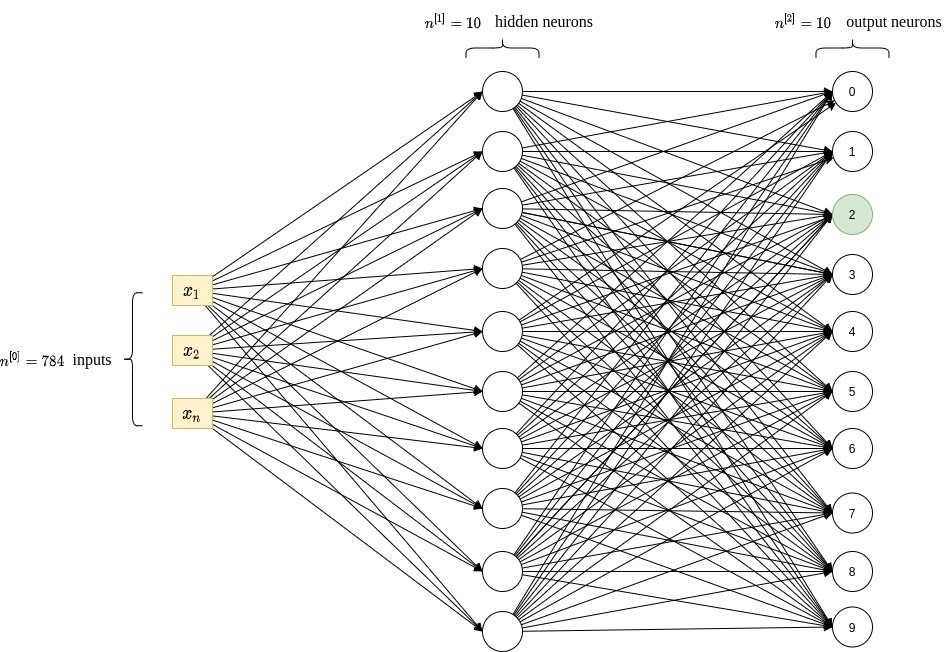
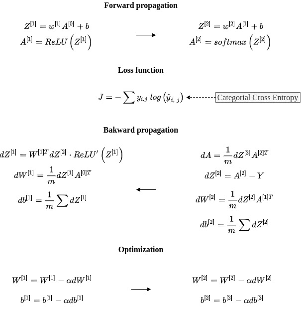
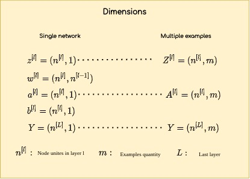

# Handwritten Digits

A simple ANN that recognizes handwritten digits on a photo of $78 \times 78$ pixels.

## Architecture

The structure of the used ANN is as follows:

- Input layer has 784 neurons. Each one has valua from 0 to 255 representing the intensity of each pixel of the image of $28 \times 28$ pixels.

- Hidden layers (uses $ReLU$). Has only one with a 10 neurons. 

- Output layer (uses $softmax$). Has 10 neurons, each one represent a probability distribution from 0 to 1 indicating which one is the most probably true answer for the given image. The output neuron with the greatest value is the guessed number for the network.

Here is a graphical representation of the network.

  

Here are the equations used for a single iteration of gradient descent:

  
  

